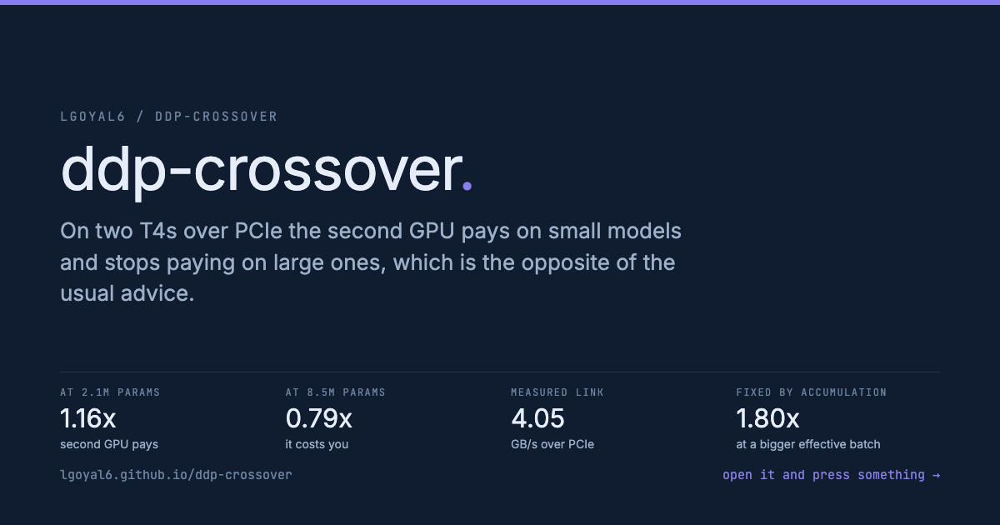

<a href="https://lgoyal6.github.io/ddp-crossover/">
  
</a>

**[Open the live demo](https://lgoyal6.github.io/ddp-crossover/)** - Drag the model size and watch the two-GPU speedup cross one, so you can see the point where the second T4 stops paying for itself.

# ddp-crossover

The advice for a second GPU is "use DDP and you get roughly 2x". That advice
assumes an interconnect. On two Tesla T4s wired over PCIe with no NVLink, the
link runs at **4.05 GB/s** measured, which is about 1/175th of the bandwidth
each GPU has to its own memory, and the arithmetic stops working.

ddp-crossover finds the point where adding the second GPU makes data-parallel
training *slower*, and then measures which of the standard mitigations actually
move that point. The small hardware is the entire point: the finding is about
the interconnect, and a pair of T4s is the regime where interconnect cost is
large enough to invert the usual assumption.

The crossover runs the opposite direction from the one I went looking for. The
second GPU pays on **small** models and stops paying on large ones, above
roughly 2-8M parameters.

> **Thesis.** "Does a second GPU help" is not a property of the model or of the
> framework, it is a ratio between gradient bytes and arithmetic, and on a slow
> link that ratio is roughly fixed regardless of model size. At batch 256 over
> PCIe, gradient sync costs about 5x the compute it buys at *every* width
> measured. The only models that appear to scale are the ones too small to be
> doing real work, where the second GPU is parallelizing launch overhead rather
> than arithmetic.

Two of the four mitigations do nothing or actively hurt, and both are published:
`bucket_cap_mb` moves throughput by under 1% across a hundredfold sweep, and
FSDP - the framework marketed for scaling - is worse than plain DDP at every
size tested.

**Turing (sm_75) has no bf16.** Every mixed-precision path here is fp16. A bf16
gradient-compression hook would either fail outright or silently emulate, so the
comparison would be measuring the wrong thing.

## What gets measured

```
01_nccl_bench.py    all-reduce and all-gather bus bandwidth, 4 KiB to 256 MiB
02_ddp_sweep.py     1-GPU vs 2-GPU DDP across a parameter sweep, plus mitigations
03_report.py        the crossover, the all-reduce fraction curve, recovery table
run_all.sh          the whole study in order
```

```bash
./run_all.sh
```

### Bandwidth is reported NCCL-style, not naively

For ring all-reduce each rank sends and receives `2*(N-1)/N` of the buffer, and
for all-gather `(N-1)/N`. Quoting algorithm bandwidth (`bytes/time`) instead
would flatter all-reduce by about 2x against all-gather and make the DDP-vs-FSDP
comparison meaningless, so `busbw` is reported alongside.

### The all-reduce fraction is measured, not inferred

DDP's `no_sync()` suppresses the gradient all-reduce while performing identical
forward and backward compute. Timing a step with and without it and taking the
difference isolates communication from compute directly, rather than estimating
it from gradient bytes divided by a bandwidth number.

### Why an MLP and not a transformer

Parameter count needs to be a clean dial. A transformer would change attention
cost, sequence length and memory layout at the same time as parameter count,
which confounds exactly the trade being measured: communication volume against
compute. A stack of square linears varies one thing.

### Throughput convention

`samples/s` counts every rank's batch and every gradient-accumulation
micro-batch, so 1-GPU and 2-GPU numbers are directly comparable. Perfect scaling
is 2.00x; **below 1.00x means the second GPU is actively harmful**, which is the
number the study exists to find.

## Mitigations swept, and why each should move the crossover

| knob | mechanism |
|---|---|
| `bucket_cap_mb` | how much gradient is coalesced per collective. Small buckets mean more, smaller messages, and `01_nccl_bench.py` shows small messages sit on a latency floor |
| gradient accumulation | syncs once per K micro-batches, dividing communication by K. The bluntest available fix |
| fp16 gradient compression | halves bytes on the wire, via a DDP comm hook |
| FSDP vs DDP | FSDP adds an all-gather of parameters on top of the gradient reduce-scatter, so at small scale it should be **worse** than DDP |

The FSDP row is the counterintuitive one and is the reason it is in the sweep:
the framework marketed for scaling should lose here, and the measurement says by
how much.

---

## Results

Kaggle, 2x Tesla T4 (sm_75, 15360 MiB each) over PCIe, torch 2.10.0+cu128,
NCCL via `torch.distributed`. MLP, depth 8, batch 256 **per rank**, SGD, fp32
weights, 30 timed steps after 5 warmup.

### The interconnect roofline

| | all-reduce | all-gather |
|---|---|---|
| peak bus bandwidth | **4.05 GB/s** | 1.73 GB/s |
| small-message floor (4 KiB) | **46.1 us** | 37.0 us |
| reaches half of peak at | 256 KiB | - |

Bandwidth is flat at 4.05 GB/s from 8 MiB upward, so above a quarter of a
megabyte this link is a fixed-rate pipe and the only lever left is sending
fewer bytes.

### The crossover, and it runs the other way

| width | params | grad MiB | 1 GPU sps | 2 GPU sps | scaling | comm % of step |
|---|---|---|---|---|---|---|
| 256 | 0.54M | 2.1 | 115,514 | 171,669 | **1.49x** | 15.0% |
| 512 | 2.13M | 8.1 | 101,729 | 118,296 | **1.16x** | 39.2% |
| 1024 | 8.46M | 32.3 | 55,783 | 44,039 | **0.79x** | 67.2% |
| 2048 | 33.7M | 128.6 | 18,429 | 12,579 | 0.68x | 65.9% |
| 4096 | 134.5M | 513.1 | 4,728 | 3,261 | 0.69x | 64.5% |
| 8192 | 537.5M | 2050.3 | 1,146 | 762 | **0.67x** | 64.6% |

**The second GPU pays on small models and stops paying on large ones**, with the
boundary between 2.13M and 8.46M parameters. That is the opposite of the usual
expectation, and of the hypothesis this study was written to test.

The reason is visible in the numbers rather than inferred. Communication is
`4 bytes x params` at 4.05 GB/s; compute is `~6 x batch x params` FLOPs at the
T4's ~8.1 TFLOP/s fp32. Both scale with parameter count, so their *ratio* is
roughly `5x` in favour of communication at batch 256 **independent of model
size**. A second GPU joined over this link cannot win a fair fight at this batch
size at any width.

Small models only win because their steps are not compute-bound at all. At width
256 a step takes 2.2 ms while containing 0.034 ms of arithmetic: it is 65x
launch overhead. The second GPU parallelizes that overhead for free, and
communication is only 15% of an already-inflated step. As width grows the step
becomes genuinely FLOP-bound, the free lunch disappears, and comm settles at
~65% of the step.

So the honest framing is not "small models fail to scale". It is: **at batch
256 over PCIe, gradient sync costs about 5x the compute it buys, and the only
models that scale are the ones too small to be doing real work.**

### What each mitigation recovers

2-GPU throughput (samples/s), 1-GPU baseline shown for the crossover:

| width | 1 GPU | DDP | bucket 1-100 MB | fp16 hook | **accum x8** | FSDP |
|---|---|---|---|---|---|---|
| 1024 | 55,783 | 44,039 | 42,421-49,093 | 58,524 | **100,191** | 35,755 |
| 2048 | 18,429 | 12,579 | 11,595-12,701 | 18,084 | **27,062** | 9,764 |
| 4096 | 4,728 | 3,261 | 3,192-3,256 | 4,267 | **6,572** | 2,528 |
| 8192 | 1,146 | 762 | 738-741 | 1,001 | **1,543** | 498 |

**`bucket_cap_mb` does nothing.** Sweeping it 1 to 100 MB moves width-8192
throughput between 738 and 741 samples/s, against a 762 baseline. The roofline
says why: the gradient buffer is 2 GB, three orders of magnitude above the
256 KiB point where bandwidth saturates, so re-chunking it cannot buy bandwidth
that is already saturated. Bucket tuning is only a lever when the buffer is near
the latency floor.

**fp16 compression buys ~1.3x and is not enough.** Halving bytes on the wire
takes width-8192 from 762 to 1,001, still **below** the 1,146 one GPU achieves.
Necessary, insufficient.

**Gradient accumulation is the only thing that rescues it.** At x8 it turns
every losing width into a win: 1.80x at width 1024, 1.35x at 8192. It is also
the bluntest instrument, dividing sync frequency by 8 and multiplying the
effective batch by the same, which changes the optimization problem rather than
just its execution.

**FSDP is worse than DDP at every size**, by a consistent 33-35%. This was the
counterintuitive prediction worth measuring, and it holds: FSDP adds an
all-gather of parameters on top of the gradient reduce-scatter, and all-gather
peaks at 1.73 GB/s here against all-reduce's 4.05. On a link this slow, sharding
costs more than it saves at every scale that fits on the card.

### Caveats

- **`comm %` is zero for the FSDP rows.** The `no_sync()` probe only exists for
  DDP; FSDP's communication is real but not separately measured here.
- **Batch is per rank**, so the 2-GPU arms process twice the samples per step
  and `samples/s` counts both. Perfect scaling is 2.00x.
- **fp32 weights.** The T4's fp16 tensor cores are unused, so compute is slower
  than a realistic mixed-precision run and the comm/compute ratio is
  correspondingly *flattering* to the second GPU. A tuned fp16 run would move
  the crossover further toward "never pays".
- **An MLP, not a transformer.** Chosen so parameter count is a clean dial; a
  transformer would vary attention cost and sequence length at the same time.
